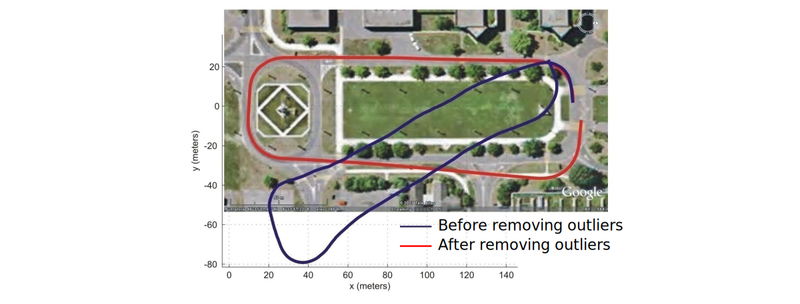

# Robust Structure from Motion

When matching points between two images or more, matched points are usually contaminated by **outliers** (i.e., wrong matches).

Causes of outliers are:

- Repetitive features
- Changes in view point (including scale) and illumination
- Image noise
- Occlusions
- Image blur

For reliable and accurate visual odometry, outliers must be removed. This is the task of **robust estimation**.

## Effect of Outliers on Visual Odometry

In the example below, we can see how outliers can greatly impact the result of our estimation process, especially over large distances.

## Expectation Maximization (EM) Algorithm

EM is a simple **method for model fitting in the presence of outliers** (very noisy points or wrong data).

- It can be applied to all sorts of problems where the goal is to estimate the parameters of a model from the data (e.g., camera calibration, Structure from Motion, DLT, PnP, P3P, Homography, etc.)

Let’s review EM applied to the line fitting problem.

### EM Applied to Line Fitting
1. Calculate model parameters that fit all data points
    
    
2. **Estimate's Expectation**: Calculate the residual error $r_i$ for each data point and assign it a weight (e.g., $w_i=e^{-r_i^2}$, where $r_i$ is the point-to-line distance) representing the probability that such assignment is correct.
    
    
3. **Maximization Step**: Re-estimate line parameters (e.g., using weighted least-squares: $\min\sum w_i r_i^2$).
    
    
4. Iterate steps 2 and 3 until convergence.
5. Select as inliers the data points with a weight higher than a given threshold.
    
    

#### Problem of EM Algorithm
The EM algorithm is sensitive to the initial condition. It is not robust to outliers if the initial condition is far from the ground truth.

Solutions: 

- GNC Algorithm
- RANSAC Algorithm

## Graduated Non-Convexity algorithm (GNC)
At each iteration, EM estimates the model by minimizing the sum of squared residuals $\sum w_i r_i^2$. While this is a convex function, it is not robust to outliers.

Idea of Graduated Non-Convexity (GNC)[^1][^2]:
[^1]: *Yang, Antonante, Tzoumas, Carlone, Graduated Non-Convexity for Robust Spatial Perception: From Non-Minimal Solvers to Global Outlier Rejection* - International Conference on Robotics and Automation (ICRA), 2020 - [PDF](https://arxiv.org/pdf/1909.08605.pdf)
[^2]: *Blake, Zisserman, Visual Reconstruction* - MIT Press, Cambridge, Massachusetts, 1987

- Optimize a surrogate function $\sum \rho_\mu(r_i)$, where $\mu$ controls the amount of non-convexity.
- Start by solving the non-robust convex optimization function ($\mu\rightarrow 0$, i.e., least squares) and gradually increase non-convexity ($\mu \rightarrow \infty$) until robustness is achieved.
- It is shown in [^1] that GNC is robust up to 90% of outliers with fewer up to five times iterations than RANSAC.

## Random Sample Consensus (RANSAC)

RANSAC[^3] has become the **standard method for model fitting in the presence of outliers** (very noisy points or wrong data).

[^3]: *M. A.Fischler and R. C.Bolles. Random sample consensus: A paradigm for model fitting with applications to image analysis and automated cartography* - Graphics and Image Processing, 1981 - [PDF](https://apps.dtic.mil/dtic/tr/fulltext/u2/a460585.pdf)

- It is **non-deterministic**: you get a different result every time you run it.
- Significantly **outperforms the EM algorithm**, it is not sensitive to the initial condition, and does not get stuck in local maxima.
- It can be applied to all sorts of problems where the goal is to **estimate the parameters of a model from the data** (e.g., camera calibration, Structure from Motion, DLT, PnP, P3P, Homography, etc.)

Let’s review RANSAC for line fitting and see how we can use it to do Structure from Motion

1. Select sample of 2 points at random from a set of points.
2. Calculate model parameters that fit the data in the sample.
3. Calculate the residual error for each data point.
4. Select data that support current hypothesis.
5. Repeat steps 1-4 $k$ times.
6. Select the set with the maximum number of inliers obtained within $k$ iterations.

!!! question "How many iterations does RANSAC need?"
    Ideally: Check all possible combinations of 2 points in a dataset of $N$ points.

    Number of pairwise combinations: $\frac{N(N-1)}{2}$

    This value can be computationally unfeasible if $N$ is too large.
    **Example**: For 1000 points you need to check all $1000\cdot 999/2\simeq 500000$ possibilities

!!! question "Do we really need to check all possibilities or can we stop RANSAC after some iterations?"
    Checking a subset of combinations is enough if we have a rough estimate of the percentage of inliers in our dataset.

    This can be done in a probabilistic way.

### Computing Number of RANSAC Iterations

For this section, let us use the following notation:

- $N$: Total Number of data points
- $w = \frac{\text{number of inliers}}{N}$
- $W = P$(selecting an inlier-point out of the dataset)

!!! info "Assumption"
    The 2 points necessary to estimation a line are selected independently

    - $w^2 = P$(both selected points are inliers)
    - $1-w^2 = P$(at least one of these points is an outlier)

Let $k$ be the number of RANSAC iterations executed so far.

- $(1-w^2)^k = P$(RANSAC never selected two points that are both inliers)

Let $p = P$(probability of success)

- $1-p = (1-w^2)^k$

Therefore the number of required iterations $k$ can be calculated as follows:

$$
k = \frac{\log(1-p)}{\log(1-w^2)}
$$

By knowing the fraction of inliers $w$, after $k$ RANSAC iterations we will have a probability $p$ of finding a set of points free of outliers.

!!! example
    If we want a probability of success $p=99\%$ and we know that $w = 50\%$, then $k=16$ iterations.

From the example above, we can see that this is far fewer than trying out all possible combinations.

!!! important
    The number of points does not influence the minimum number of iterations ($k$), only $w$ does!

### The Three Key Ingredients of RANSAC
In order to implement RANSAC for Structure From Motion (SFM), we need three key ingredients:

1. **What’s the model** in SFM?

    - The **essential matrix** (for calibrated cameras) or the **fundamental matrix** (for uncalibrated cameras)
    - Alternatively, $R$ and $T$

2. What’s the **minimum number of points** to estimate the model?

    - We know that 5 points is the theoretical minimum number of points for calibrated cameras
    - However, if we use the 8-point algorithm, then 8 is the minimum (for both calibrated or uncalibrated cameras)

3. How do we compute the **distance** of a point from the model?

    - Algebraic error
    - Directional error
    - Epipolar line distance
    - Reprojection error