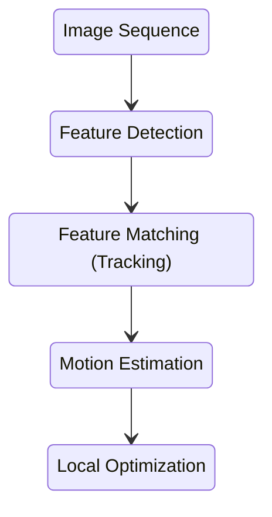

# Visual Odometry Overview

## What is Visual Odometry (VO)?
VO is the process of incrementally estimating the pose of the vehicle by examining the changes that motion induces on the images of its onboard cameras.

## Why VO?
- VO is crucial for flying, walking, and underwater robots
- Contrary to wheel odometry, VO is not affected by wheel slippage (e.g., on sand or wet floor) (wheel odometry error can be up to 10%)
- Very accurate: relative position error is 0.1% − 2% of the travelled distance
- VO can be used as a complement to
    - Wheel encoders (wheel odometry)
    - GPS (when GPS is degraded)
    - Inertial Measurement Units (IMUs)
    - Laser odometry

### Assumptions
- Sufficient illumination in the environment
- Dominance of static scene over moving objects
- Enough texture to allow apparent motion to be extracted
- Sufficient scene overlap between consecutive frames

## Brief History of VO
- 1980: First known VO real-time implementation on a robot by Hans Moraveck PhD thesis (NASA/JPL) for Mars rovers using one sliding camera (sliding stereo).
- 1980 to 2000: The VO research was dominated by NASA/JPL in preparation of the 2004 mission to Mars
- 2004: VO was used on a robot on another planet: Mars rovers Spirit and Opportunity (see seminal paper from NASA/JPL, 2007)
- 2004: VO was revived in the academic environment by David Nister’s «Visual Odometry» paper. The term VO became popular
- 2015-today: VO becomes a fundamental tool of several products: VR/AR, drones, smartphones
- 2021: VO is used on the Mars helicopter Ingenuity

## VO Vs. VSLAM Vs. SFM

### VO Vs. Structure from Motion (SFM)
SFM is more general than VO and tackles the problem of 3D reconstruction and 6DOF pose estimation from unordered image sets.

- VO is a particular case of SFM.
- VO focuses on estimating the 6DoF motion of the camera sequentially (as a new frame arrives) and **in real time**.
- Terminology: sometimes SFM is used as a synonym of VO

VO Vs. Visual SLAM (VSLAM)

- Visual Odometry
    - Focus on incremental estimation
    - Guarantees local consistency (i.e., estimated trajectory is locally correct, but not globally, i.e. from the start to the end)
- Visual SLAM (Simultaneous Localization And Mapping)
    - SLAM = visual odometry + **loop detection & closure**
    - Guarantees global consistency (the estimated trajectory is globally correct, i.e. from the start to the end)

## VO Flow Chart
VO computes the camera path incrementally (pose after pose).

The steps involving feature detection to motion estimation are known as the "front-end". They output the relative post between the last two frames.

The last step (local optimization) adjusts the relative poses amongst multiple recent frames.

VO studies the incremental camera path computation (frame after frame).
