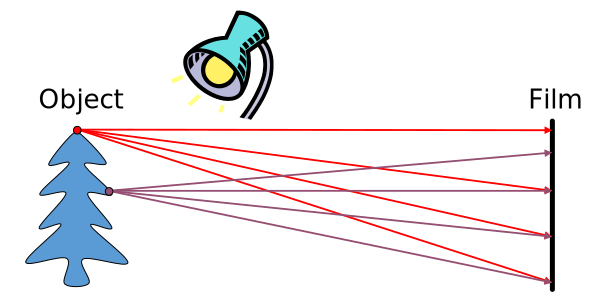
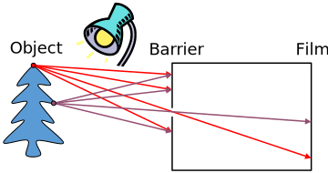
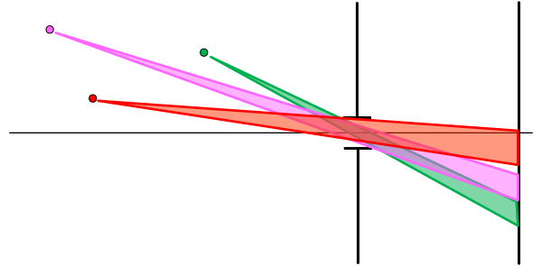
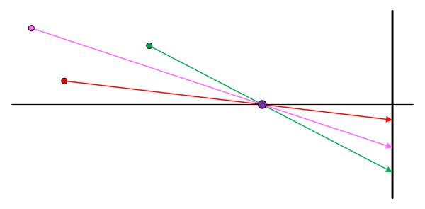

# Image Formation

## Historical Context
- **Pinhole Model**: Mozi (470-390 BCE), Aristotle (384-322 BCE)
- Principles of optics (including lenses): Alhacen (965-1039)
- Camera obscura: Leonardo da Vinci (1452-1519), Johann Zahn (1631-1707)
- **First Photo (Heliography)**: Joseph Nicephore Niepce (1822)
- **Daguerréotypes** (1839)
- Photographic film (Eastman, 1888, founder of Kodak)
- Cinema (Lumière Brothers, 1895)
- Color Photography (Lumière Brothers, 1908)
- Television (Baird, Farnsworth, Zworykin, 1920s)
- **First consumer camera with CCD**: Sony Mavica (1981)
- **First fully digital camera**: Kodak DCS100 (1990)

## Image Formation - How are objects in the world captured in an image?
Would such a setup work?

</img>

The problem here is that all light rays from every point in the world are being seen by the film, making the image white.

A first solution is to add a barrier to block off most rays.

- This reduces blurring
- The measurement of the opening is known as the **aperture**.

</img>

This solution is commonly referred to as the "Camera Obscura".

- In Latin, camera obscura means "dark room"
- Basic principle known to Chinese philosopher Mozi (470-390 BC) and Aristotle (384-322 BC)
- Drawing aid for artists: described by Leonardo da Vinci (1452-1519)

### Effects of Aperture Size
A large aperture makes the image blurry because multiple rays of light are let through from each world’s point.

</img>

By shrinking the aperture, the image becomes sharper. The ideal aperture is a pinhole that only lets through one ray of light from each world's point.

</img>

#### Why not make the aperture as small as possible?

- With small apertures, less light gets through &#8594; must increase exposure time.
- The aperture gets too small, diffraction effects start to appear.
- The optimal size of aperture depends on the focal length as well.